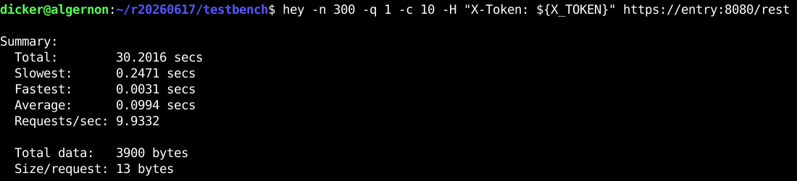
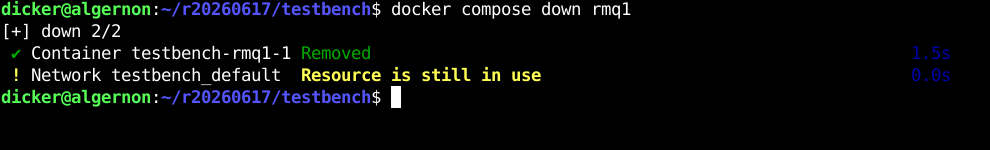
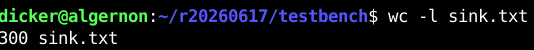

# Проект Docker compose

Остался без изменений. Запускается:

```bash
cd testbench/ssl
bash generate.sh
cd ..
docker compose pull
docker compose up
# до 5 минут может потребоваться всем этим замечательным
# elasticsearch и rabbitmq, чтобы прийти в себя и
# собраться с мыслями.
sleep 300
bash elastic.sh setup
```

# Брокер сообщений

Подключён троированный брокер сообщений RabbitMQ, получающий от сервиса world после каждого запроса извне сообщение с отметкой времени. Для приёма сообщений реализован отдельный сервис rabbitmqsink, который сбрасывает принятые сообщения в файл, добавляя к каждому сообщению большой массив случайных данных.

Попробуем выполнить 300 запросов при помощи утилиты hey, в течении 30 с.



Во время выполнения запросов остановим один из экземпляров брокера



Видно, что, несмотря на это, все 300 пакетов доходят и сохраняются в файл.



# Elasticsearch

Файл с сообщениями, сохранёнными сервисом rabbitmqsink, читается контейнером fluent-bit, который затем сохраняет полученные данные в базу elasticsearch.

Попробуем выполнить 1000 запросов при помощи утилиты hey:


Теперь запросим статистику из elasticsearch при помощи запросов к базе или при помощи grep:


Видно, что запрос к elasticsearch выполняется за 27мс, а текстовый поиск в файле размером > 1G - за 475мс. Ну да, действительно, искать в хэш-таблице проще, чем в тексте.
