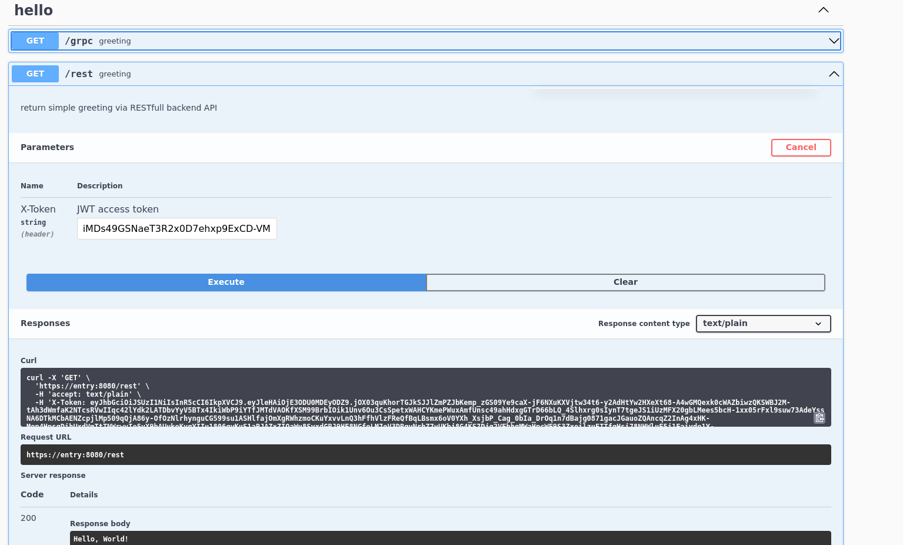
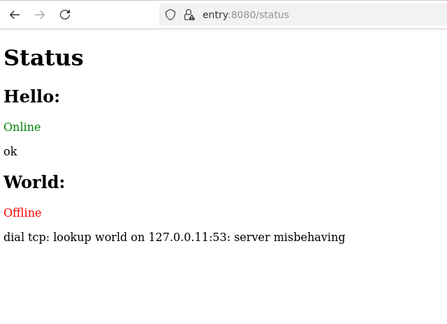
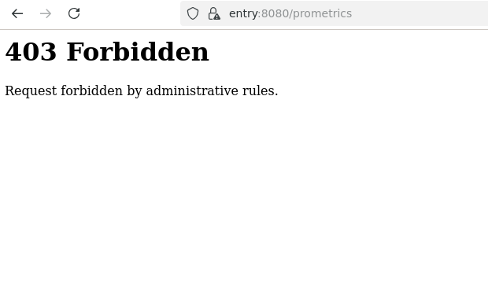
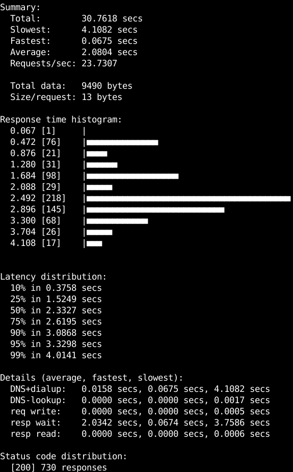
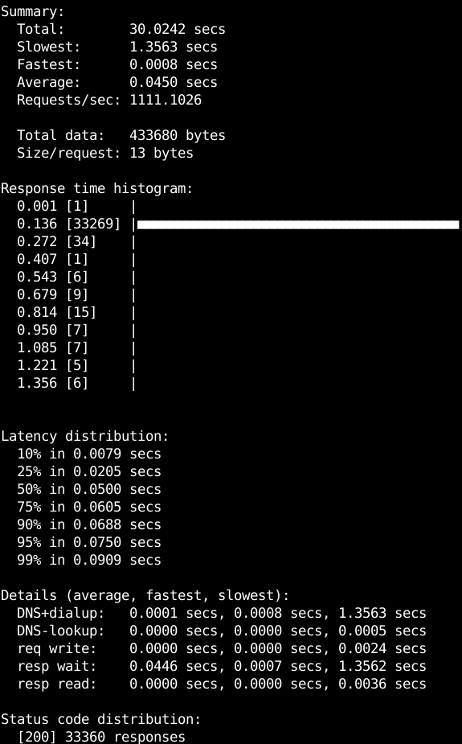
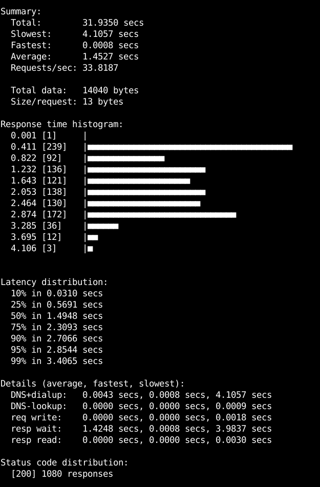

# Проект Docker compose

Остался без изменений. Запускается:

```bash
cd testbench/ssl
bash generate.sh
cd ..
docker compose pull
docker compose up
```

# API

Внешний API имеет несколько точек входа:

 * /rest - сервис entry взаимодействует с подчинёнными ему сервисами hello и world по HTTPS
 * /grpc - сервис entry взаимодействует с подчинёнными ему сервисами hello и world по gRPC
 * /swagger/index.html, /swagit - Web-страница swagger



 * /status - Web-страница статуса сгенерированная при помощи шаблонизатора html/template



В момент снятия отчёта сервис world был отключён командой

```bash
docker compose down world
```

Доступ к точке метрик Prometheus /prometrics заблокирован, точка доступна только из внутренней сети Docker.



# Сравнение производительности REST и gRPC

Для сравнения производительности REST и gRPC использовалась, как и ранее, утилита hey:

```bash
X_TOKEN="$(wget --ca-cert /usr/local/share/r20260617/ca.crt https://entry:8080/rest -O - -q)"
hey -z 30s -H "X-Token: $X_TOKEN" https://entry:8080/rest
```



```bash
X_TOKEN="$(wget --ca-cert /usr/local/share/r20260617/ca.crt https://entry:8080/grpc -O - -q)"
hey -z 30s -H "X-Token: $X_TOKEN" https://entry:8080/grpc
```



Видно, что, как и следовало ожидать, gRPC обеспечивает значительно меньшую и стабильную задержку обработки, и, следовательно, большее число обслуженных запросов.

UPD в случае повторного использования клиента HTTP производительность несколько увеличивается


