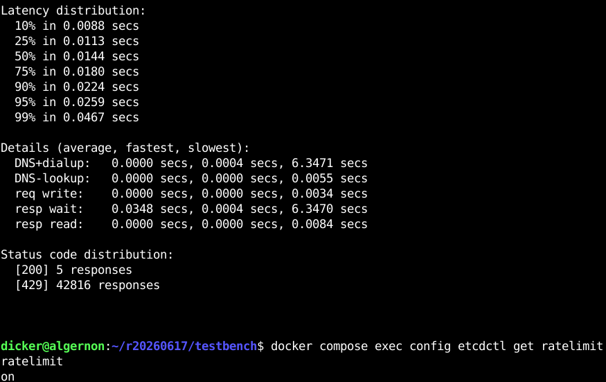
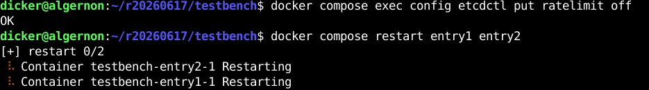
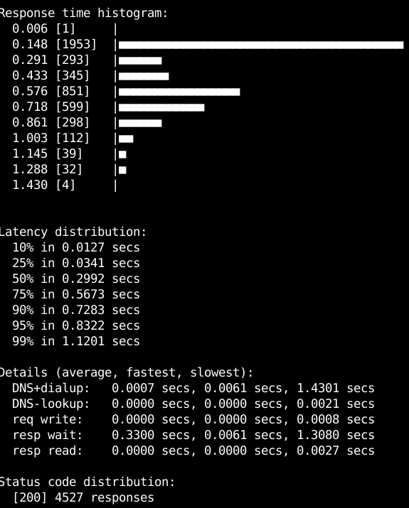
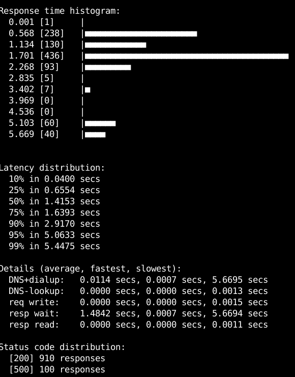
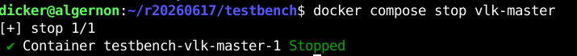
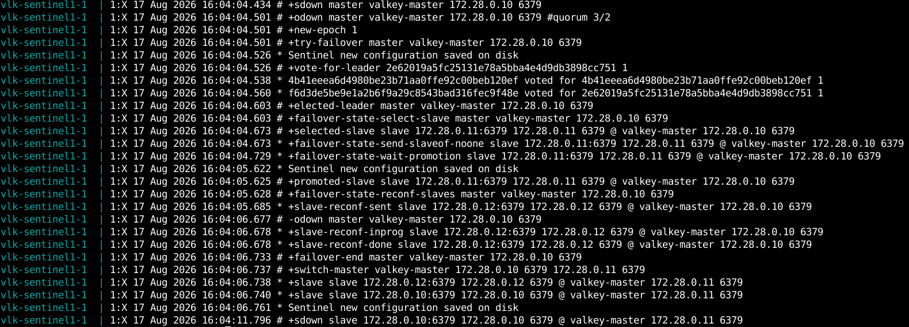

# Проект Docker compose

Остался без изменений. Запускается:

```bash
cd testbench/ssl
bash generate.sh
cd ..
docker compose pull
docker compose up
```

# Конфигурация

Используется один экземпляр etcd в контейнере

# Ratelimiter

Используется БД valkey, готовый пакет valkey-go/valkeylimiter



Видно, что большинство запросов на генерацию токена завершаются со статусом 429



После отключения в конфигурации ограничения скорости и перезапуска контейнеров (для простоты слежение за изменениями в конфигурации не реализовано)



Видно, что скорость обслуживания упала, т.к. отвергнуть запрос со статусом ошибки значительно легче

# Резервирование

Вспомогательный сервис hello также обращается к БД valkey. Запущены 1 master и 2 slave контейнера valkey, а также 3 sentinel контейнера valkey.

Отключение master-контейнера производится в то время, как утилита hey проводит нагрузочное тестирование




Видно, что часть запросов обслужено с ошибкой 500 из-за того, что происходит поиск нового master. В журнале sentinel valkey видно (для примера взят только один из экземпляров), как происходит в этот момент назначение нового master


