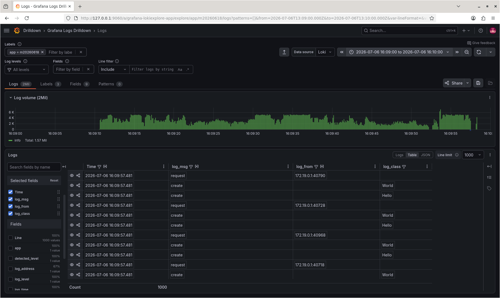
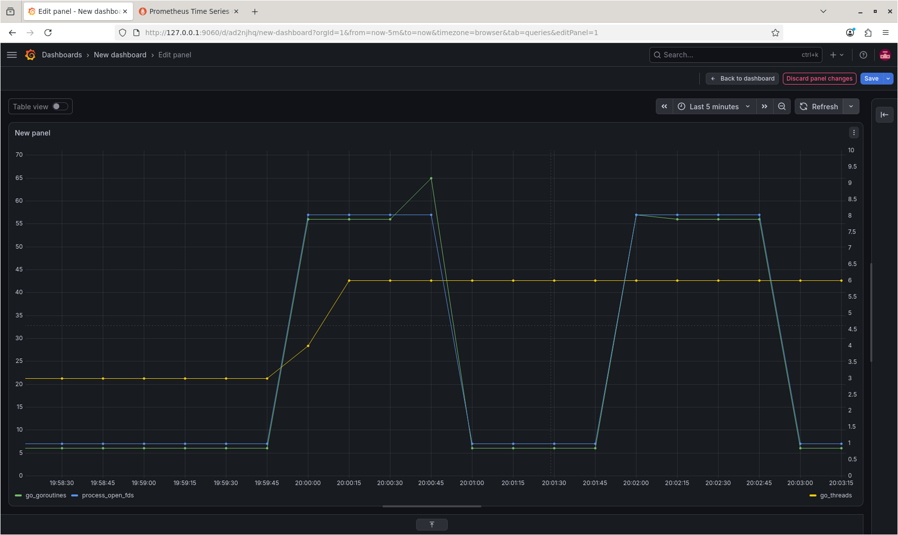
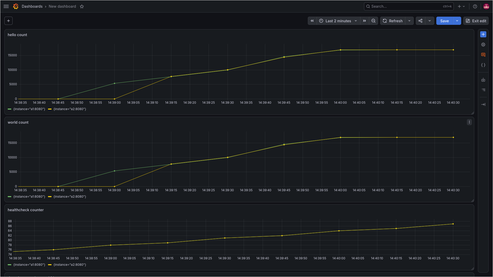

# Проект Docker compose

Задействованные компоненты используются внутри контейнеров docker, запускаемых внутри каталога testbench командой

```bash
docker compose up
```

Поскольку все они находятся в одной сети docker, "наружу" выводятся только интерфейсы экземпляров тестового сервиса и веб-интерфейс Grafana и Prometheus.

# Журналирование

Используется Fluent-bit+Loki. Конечно, лучше было брать не Fluent, а специализированного клиента, но я повёлся на то, что это же UNIX, всё можно соединять через стандартный вывод. Пришлось научить Fluent-bit читать логи контейнеров Docker. Ну, с грехом пополам, отключив "шум" всех контейнеров, кроме целевых, чтобы логгер не логировал сам себя.

# Сбор метрик

Используется Prometheus, данные собираются стандартно через библиотеку-клиента. Собираются как внутренние метрики Go, так и, с позволения сказать, бизнес-метрики (даже три), для чего пришлось добавить их сбор в приложение.

# Визуализация

Используется Grafana

# Алертинг в ТГ

Настроить не удалось по уважительным обстоятельствам непреодолимой силы.

# Тестирование

Использовалась утилита hey, облучавшая сервисы в течении 60с силой 1000 worker-ов:

```bash
hey -z 60s -n 1000 http://....
```

Таблица структурированных логов, убраны неинформативные поля.




Метрики Prometheus, видно, что под нагрузкой число потоков остаётся постоянным, число горутин увеличивается до максимума, а после нагрузки возвращается в исходное состояние.



Бизнес-метрики, видно, что под нагрузкой счётчик растёт равномерно, healthcheck работает.



Источник облучал сервисы 60с, видно, что завершение роста числа обслуженных запросов задерживается относительно завершения облучения на 15с, что согласуется с выводом статистики источника: там 99% задержек составило 10с.
