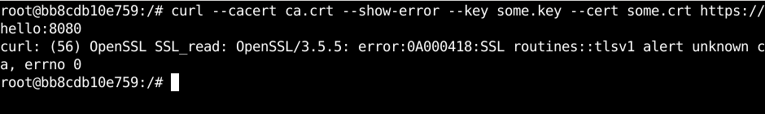
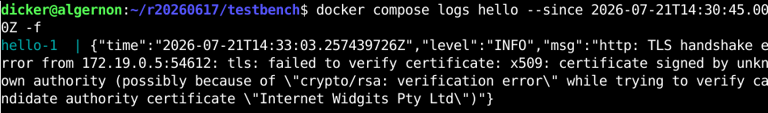
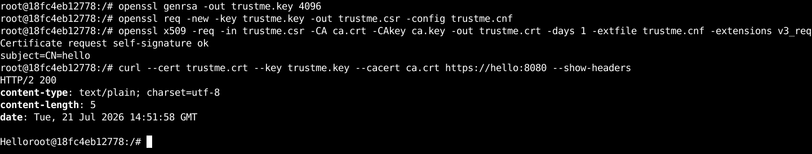
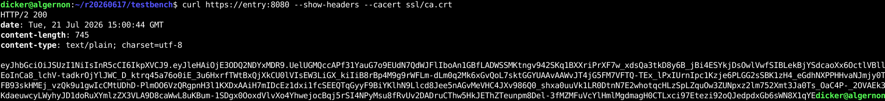
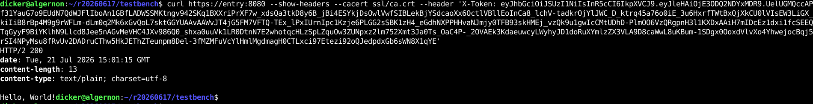
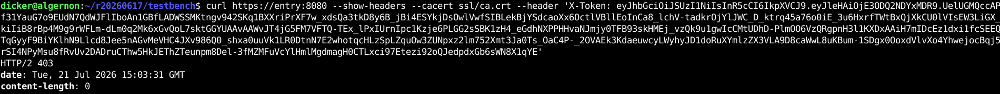
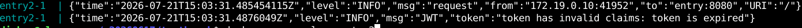

# Проект Docker compose

Проект разделён на три сервиса: entry, hello, world. Сервис entry при получении запроса GET / обращается к сервисам hello и world. Взаимодействие защищено mTLS. Задействованные компоненты используются внутри контейнеров docker, запускаемых внутри каталога testbench командой

```bash
cd testbench/ssl
bash generate.sh
cd ..
docker compose up
```

# mTLS

Для имитации действия неавторизованного пользователя используется отдельный контейнер t. Его попытки обратиться к внутреннему сервису hello неуспешны:




Однако при использовании правильного сертификата:


# HTTPS

Для входного HTTPS используется HAProxy в режиме HTTPS.



# JWT

Используется низкоуровневая библиотека golang-jwt. При запросе GET / проверяется наличие заголовка X-Token. В случае отсутствия, генерируется и возвращается новый токен сроком действия 1 минута.


В случае наличия, токен проверяется.



Если срок действия токена истёк, ошибка 403.



